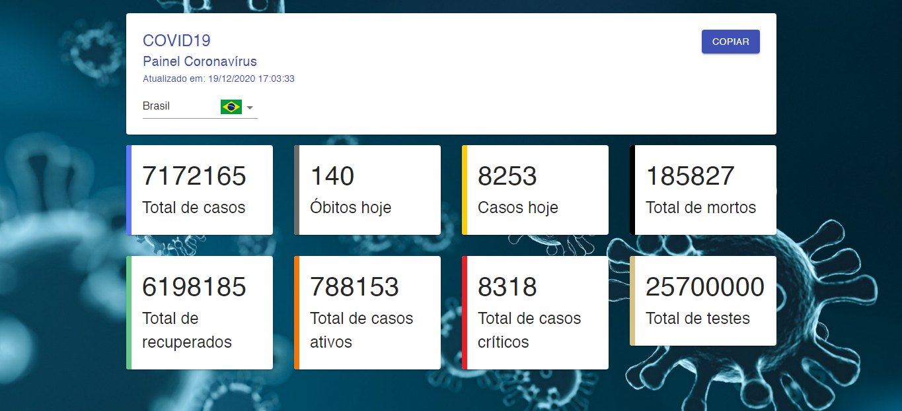
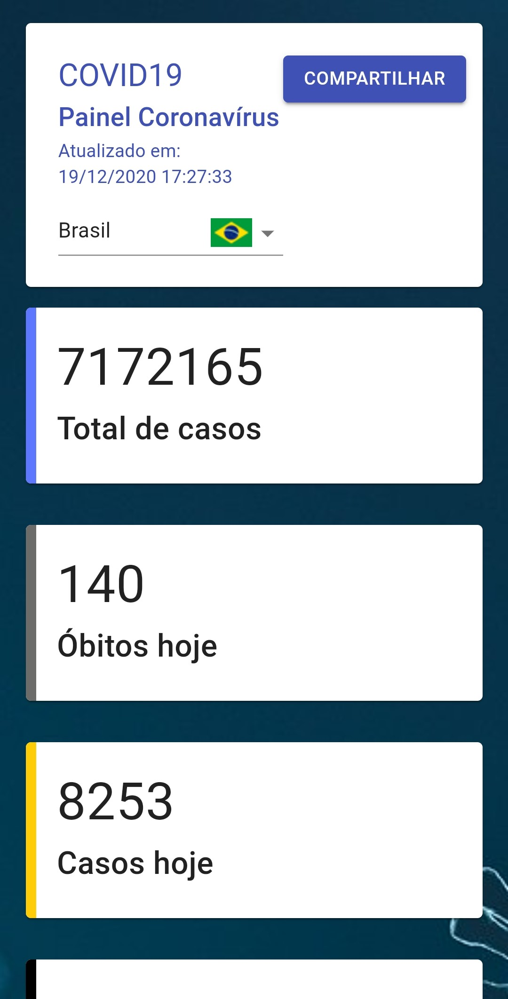
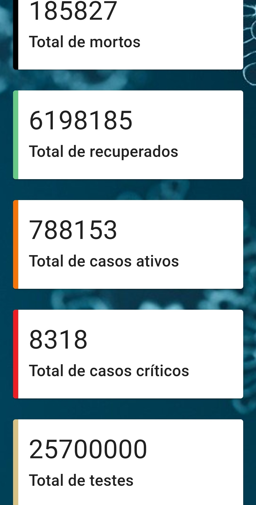
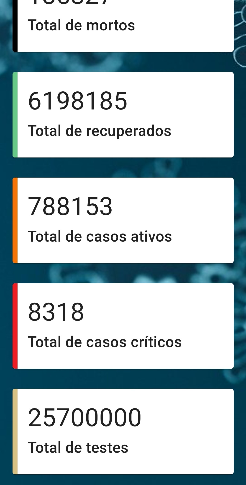

[](https://github.com/marioandre01)
[](#)
[](https://github.com/marioandre01/covid19_react-dio/stargazers)
[](https://github.com/marioandre01/covid19_react-dio/network/members)
[](https://github.com/marioandre01/covid19_react-dio/graphs/contributors)
[](https://github.com/marioandre01/covid19_react-dio/blob/master/LICENCE.md)


<h1 align="center">
    covid19_react-dio
</h1>

<p align="center"> 
  <a href="#-projeto">Projeto</a>&nbsp;&nbsp;&nbsp;|&nbsp;&nbsp;&nbsp;
  <a href="#-tecnologias">Tecnologias</a>&nbsp;&nbsp;&nbsp;|&nbsp;&nbsp;&nbsp;
  <a href="#-layout">Layout</a>&nbsp;&nbsp;&nbsp;|&nbsp;&nbsp;&nbsp;
  <a href="#-executando-a-aplicação">Executando a aplicação</a>&nbsp;&nbsp;&nbsp;|&nbsp;&nbsp;&nbsp;
  <a href="#gear-contribuição">Contribuição</a>&nbsp;&nbsp;&nbsp;|&nbsp;&nbsp;&nbsp;
  <a href="#memo-licença">Licença</a>
</p>

## 💻 Projeto

Esse projeto foi desenvolvido através do [bootcamp SPTech Desenvolvimento Front-end](https://digitalinnovation.one/bootcamps/sp-tech-desenvolvimento-fullstack) oferecido pela [Digital Innovation One - DIO](https://digitalinnovation.one/) e orientado pelo instrutor Bruno Carneiro.

O projeto teve como objetivo criar uma "Progressive Web Application (PWA)" utilizando React, tendo como tema o cenário da covid19. A aplicação consiste em um painel para se manter informado a respeito de todos os casos do COVID19 pelo mundo. Com o seu desenvolvimento aprendeu-se como criar uma aplicação para ser executada no browser e funcionar como aplicativo contendo algumas funcionalidades de um aplicativo nativo mobile através do uso de PWA, sem precisar subir para a Play Store ou App Store.

Para se ter um desafio a ser feito na aplicação, foi adicionado na lista de países novos países para se escolher, sendo eles Espanha, Argentina, África do Sul, Japão, Rússia, Índia, Suécia e Canadá. Na introdução das bandeiras de cada país adicionado se utilizou o site [www.countryflags.com](https://www.countryflags.com/) para as mesmas ficarem no mesmo padrão apresentado no projeto. Também foram adicionados três novos boards com os dados de "Total de casos ativos", "Total de casos críticos" e "Total de testes".

O resultado da aplicação pode ser acessado através da seguinte URL:
[https://covid19-panel.netlify.app](https://covid19-panel.netlify.app)

## 📋 Tecnologias

O projeto foi desenvolvido com as seguintes tecnologias:

- HTML
- CSS
- Javascript
- [ReactJS](https://pt-br.reactjs.org/)
- Fetch
- [Material-UI (React UI framework)](https://material-ui.com/pt/)
- [Styled-components](https://styled-components.com/)


## 🎨 Layout

### 💻 Web 

<p align="center">
  
</p>

### 📱 Mobile 

<p align="center">
  
    
    
</p>

## 💻 Executando a aplicação

### Requisitos necessários

Para executar o projeto é necessário ter instalado em seu sistema:
- NodeJS
- Gerenciador de pacotes Npm ou Yarn 

### :octocat: Clonando o Repositório

```bash
$ git clone https://github.com/marioandre01/covid19_react-dio.git

# entre na pasta do projeto
$ cd covid19_react-dio
```
### 💻 Executando a aplicação

Instale as dependências

```bash

$ yarn

# ou pelo npm
$ npm install

```

Execute a aplicação

```bash

$ yarn start

# ou pelo npm
$ npm start

```

## :gear: Contribuição

Para contribuir com esse projeto faça os seguintes passos:

- Faça um fork desse repositório;
- Crie uma branch com a sua feature: `git checkout -b minha-feature`;
- Faça commit das suas alterações: `git commit -m 'feat: Minha nova feature'`;
- Faça push para a sua branch: `git push origin minha-feature`.

## :memo: Licença

Esse projeto está sob a licença MIT. Veja o arquivo [LICENSE](./LICENSE) para mais detalhes. a


